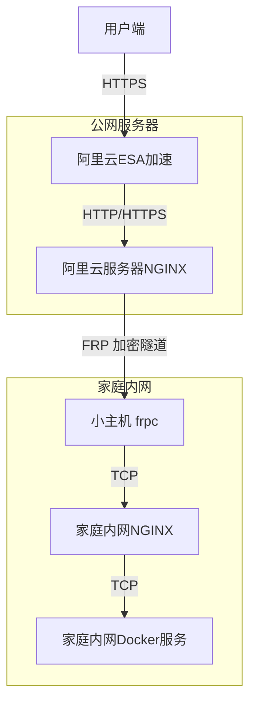
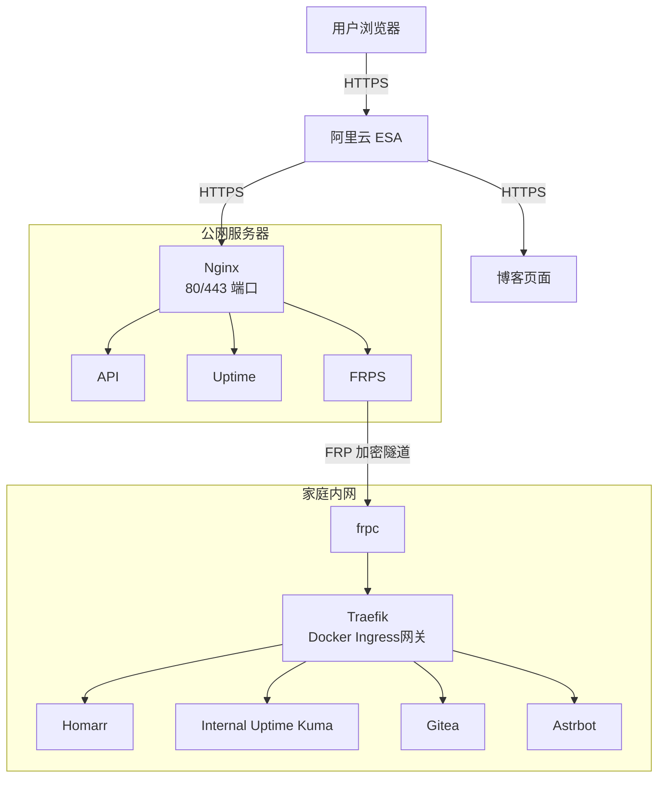

# 网络穿透架构

因为要折腾个人建站，所以最近把家里的服务架构完全重构了一遍，从原来的单nginx+Tailscale域名访问到现在挪入公网访问，整个过程废了太多时间，也见识了挺多新东西

## 为什么需要重构？

先说说原来的架构如果直接搬到公网有多复杂：



这么一层层套下来，问题也接踵而至：

- 端口占用多，每个服务都要单独配置
- HTTPS 证书管理麻烦，每一层都要考虑
- 加个新服务要改一堆配置，哪个地方漏了完全没头绪
- 排查问题的时候不知道到底哪一层出了问题

说白了就是过度设计，为了"统一入口"把自己绕进去了。

而且这两层nginx一点都不优雅，每层都要占用好多端口。

## 新的架构长啥样？

经过一番研究（和多个 AI 窗口讨论），最终定下来的架构简单多了：



核心就三点：

1. **根域名走 ESA Pages** - 纯前端静态页面，~~放上来干嘛，我又不会写博客~~
2. **子域名走 ECS** - 通过 Nginx 转发到 FRP，再进内网
3. **内网用 Traefik** - Docker 容器自动发现，配置写在 label 里~~省端口啊，宿主机的端口开多了又难管理又占地方~~

## 为啥选 Traefik？

说实话，一开始我也纠结过用 Nginx 还是 Traefik。毕竟 Nginx 更成熟，网上教程更多。但最后选了 Traefik，主要是看中了这几个特点：

**自动服务发现** - 这是最吸引我的。以前加个新服务，得写 nginx 配置、改域名、 reload，现在只要在 docker-compose 里加个 label，Traefik 自己就发现了。

**动态配置** - 不用重启，改了配置立马生效。这对经常测试的人来说太友好了。

**证书自动化** - 虽然我的证书主要在 ECS 上管理，但 Traefik 自带的 ACME 功能还是很方便的，以后要是需要内网证书也能直接用。

不过话说回来，Traefik 的 Dashboard 确实不咋地……界面丑就算了，有时候反应还慢。可能是 DeepSeek 被塞了 Traefik 的软广，一直给我推这个。😅
~~感觉Qwen也被塞了广告，我没想写这些😅~~

## 关键配置要点

### 公网服务器这边

ECS 上主要就两个东西：Nginx 和 frps。

Nginx 负责干两件事：一是处理 HTTPS 证书，Certbot 一键申请自动续期；二是把请求转发到本地的 frps 端口。

```nginx
server {
    listen 443 ssl;
    server_name *.kyangconn.cn;

    ssl_certificate /etc/letsencrypt/live/kyangconn.cn/fullchain.pem;
    ssl_certificate_key /etc/letsencrypt/live/kyangconn.cn/privkey.pem;

    location / {
        proxy_pass http://127.0.0.1:8080;
        proxy_set_header X-Forwarded-Proto https;
    }
}
```

这里用了通配符证书，所有子域名都不用单独配置了。

frps 就更简单了，就是个 TCP 转发器，监听 7000 端口，收到请求就通过加密隧道发给内网的 frpc。

### 内网小主机这边

内网的核心是 Traefik 容器，它通过 Docker Socket 监听其他容器的启动事件。

```yaml
services:
  traefik:
    image: traefik:latest
    command:
      - "--providers.docker=true"
      - "--providers.docker.exposedbydefault=false"
      - "--entrypoints.web.address=:80"
    volumes:
      - /var/run/docker.sock:/var/run/docker.sock:ro
```

`exposedbydefault=false` 这个参数很重要，不然所有容器都会被暴露出来，不好看不说，也不安全。

具体服务的配置都写在 label 里，比如 Gitea：

```yaml
services:
  gitea:
    labels:
      - "traefik.enable=true"
      - "traefik.http.routers.gitea.rule=Host(`git.kyangconn.cn`)"
      - "traefik.http.services.gitea.loadbalancer.server.port=3000"
```

就这么简单，加个服务就是加一段 yaml，不用碰任何配置文件。

### FRP 的配置

frpc 就是把内网的 80 端口（Traefik）通过隧道转发到公网服务器的 8080 端口。

```ini
serverAddr = "xxx.xxx.xxx.xxx"
serverPort = 7000
auth.method = "token"
auth.token = your_secure_token

[[proxies]]
name = "traefik-http"
type = "tcp"
localIP = "127.0.0.1"
localPort = 80
remotePort = 8080
transport.useEncryption = true
transport.useCompression = true
```

记得开启 TLS 加密，不然流量就是明文传输的。

## SSH 透传那点事

Gitea 要用 SSH 协议克隆仓库，这就涉及到一个经典问题：怎么把公网的 22 端口转发到内网？

直接在 ECS 上用 22 端口会跟系统 sshd 冲突，所以我的做法是：

1. 在 ECS 上创建 git 用户
2. 配置 sshd 的 ForceCommand，让 git 用户的连接执行一个转发脚本
3. 脚本把 SSH 连接通过 2222 端口转发到内网
4. 内网 Traefik 再用 TCP Router 转发到 Gitea 的 22 端口

听起来很复杂，其实就几行配置的事。关键是用户那边不用改习惯，还是 `git@git.kyangconn.cn`，只是底层做了透明转发。

## 成本核算

这套架构的成本其实很低（~~低在哪里！狗Qwen~~）：

- 域名：30-50 元/年
- ECS（武汉节点）：99 元/年，续费同价
- ESA 免费版：0 元，包含全球加速和基础安全
- SSL 证书：Let's Encrypt 免费

## 踩过的坑

### 1. P2P 端口别走代理

qBittorrent 的 P2P 端口如果走 Traefik 代理，速度巨慢。后来直接在容器上映射 UDP/TCP 端口，绕过代理层，速度恢复正常。也别把任何需要大量连接的（例如BT）放在rootless docker里。

## 2. SSH 别开FRP的加密和压缩

SSH透传设置的时候怎么都联不通，后来发现是FRP的加密和压缩都开了，导致加密对不上。以及别信AI的只需要设置一个SSH密钥，你经过了多少SSH服务器你就得复制多少份你的私钥和公钥。


