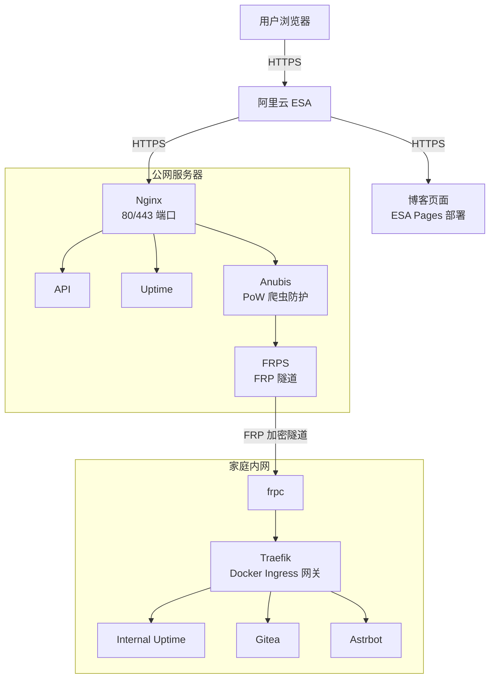

## 前言

随着网络爬虫和自动化攻击的日益增多，传统的验证码方案已经显得力不从心。CAPTCHA不仅体验不好，一般还收费。近年来，Proof of Work（PoW，工作量证明）作为一种更友好的防护方案逐渐受到关注。

## 为什么选择 Anubis

在考虑防护方案时，我主要关注了以下几个因素：

### 云服务商的防护局限

我使用的阿里云 ESA（边缘安全加速）提供免费和基础版本，但仔细研究后发现：

- **免费版本**：基本没有实质性的防护能力
- **基础版**：防护功能非常有限
- **高等级防护**：需要付费，且价格不菲

对于个人项目来说，性价比不高。因此我决定自己搭建防护层。

### 其他方案的对比

在选择具体工具时，我也调研了其他几个 PoW 防护方案：

| 方案                     | 优点                         | 缺点                 |
| ------------------------ | ---------------------------- | -------------------- |
| **Anubis**               | 开源免费、配置灵活、界面友好 | 需要自行维护         |
| **Cloudflare Turnstile** | 无需维护、集成简单           | 依赖第三方、隐私考量 |
| **hCaptcha**             | 免费、支持自定义             | 用户体验一般         |

最终选择 Anubis 的原因很简单：**开源可控、完全免费、功能足够**。

## 架构设计

因为anubis也是一个服务，根据官方文档的架构，anubis适合放在反代后面，放在服务前面，



整体设计架构如下所示：



从图中可以看到：

1. **博客页面（ESA Pages）**：不受 Anubis 保护，直接通过 ESA 访问
2. **内部服务**：通过 Nginx → Anubis → FRP → Traefik 的链路访问
3. **防护范围**：仅对需要防护的服务启用 Anubis

## 核心配置

本文配置参考：

### 环境变量配置

Anubis 的主配置文件是 `.env`：

```bash
#cat /etc/anubis/nova.env
BIND=:8923
DIFFICULTY=4
METRICS_BIND=:9090
SERVE_ROBOTS_TXT=trusted
TARGET=http://localhost:8080
WEBMASTER_EMAIL=kyangconn@example.com
COOKIE_SAME_SITE=Default
USE_REMOTE_ADDRESS=true
POLICY_FNAME=/etc/anubis/novaPolicies.yaml
REDIRECT_DOMAINS=example.kyangconn.cn, example2.kyangconn.cn
```

各参数说明：

| 参数                 | 说明                                                                                | 建议值                          |
| -------------------- | ----------------------------------------------------------------------------------- | ------------------------------- |
| `BIND`               | Anubis 监听地址和端口                                                               | `:8923`                         |
| `DIFFICULTY`         | PoW 难度级别（数值越大越难）                                                        | `4`（可根据实际情况调整）       |
| `METRICS_BIND`       | Prometheus 指标暴露端口                                                             | `:9090`                         |
| `SERVE_ROBOTS.TXT`   | 是否提供默认的 robots.txt                                                           | `true`                          |
| `TARGET`             | 后端服务地址                                                                        | 根据实际情况修改                |
| `WEBMASTER_EMAIL`    | 站长邮箱                                                                            | 填写你的邮箱                    |
| `COOKIE_SAME_SITE`   | 默认cookie策略，影响跨站与否，不过现代浏览器不允许你用cookie跨站了，所以直接default |
| `USE_REMOTE_ADDRESS` | Anubis识别真实IP的方式                                                              | `true`                          |
| `POLICY_FNAME`       | Bot 策略配置文件路径                                                                | `/etc/anubis/novaPolicies.yaml` |
| `REDIRECT_DOMAINS`   | 重定向域名列表                                                                      | 用逗号分隔                      |

**注意**：`REDIRECT_DOMAINS` 记得确认你的所有子域名和反代到Anubis的一样，不然不在redirect里但是反代到anubis就会报错。

### Bot 策略配置

默认的策略文件位于 `/usr/share/doc/anubis/botPolicies.yaml`，复制一份到 `/etc/anubis/novaPolicies.yaml` 后进行修改：

```yaml
# 自定义规则
rules:
  # 允许 API 接口，避免影响自动化调用
  - name: "allow-my-api"
    path_regex: "^/api/.*$"
    action: "ALLOW"

  # 允许静态资源，提升加载性能
  - name: "allow-safe-assets"
    path_regex: "^/assets/.*\\.(css|js|jpg|jpeg|png|gif|svg|webp|ico|woff2?|ttf|eot|json|map)$"
    action: "ALLOW"
```

**重要说明**：

1. **默认导入机制**：如果你直接复制 `/usr/share/doc/anubis/botPolicies.yaml`，那么这里面包含所有默认配置，所以你的自定义规则是**追加**而不是覆盖。这意味着默认的 bot 检测规则仍然生效。

2. **例外设置的重要性**：Anubis 会对所有请求进行 PoW 验证，包括 API 调用和静态资源加载。如果不设置例外，会导致：
   - API 客户端频繁遇到 PoW 挑战
   - 静态资源加载变慢（每个资源都要先完成 PoW）
   - 移动端体验下降

3. **路径正则表达式**：
   - `/api/.*`：匹配所有以 `/api/` 开头的路径
   - `/assets/.*\.(css|js|...)`：匹配静态资源文件，根据实际需求调整扩展名列表

## 部署

Anubis在release提供几乎所有的二进制包，包括`.deb`包，官方没提是错的。下载下来然后用包管理器安装就完事了，不过别忘了弄完配置文件(`/etc/anubis/name.env`)后`systemctl enable --now anubis@name`来启动。

## 常见问题

### Q: 如何调整 PoW 难度？

A: 修改 `DIFFICULTY` 参数即可。数值范围建议：

- `1-2`：非常宽松，适合内部服务
- `3-4`：适中，适合对外服务（推荐）
- `5+`：较严格，可能影响用户体验

### Q: 主博客为什么不加防护？

A: 这是一个权衡决策。我的博客是静态页面，通过 ESA Pages 部署，没办法再加 Anubis。

### Q: 能否完全禁用某些 IP 的 PoW 验证？

A: 可以在你的 `Policies.yaml` 中添加基于 IP 的规则，或者增加基于GeoIP的规则：

```yaml
- name: "allow-trusted-ip"
  ip_whitelist:
    - "192.168.1.0/24"
    - "10.0.0.0/8"
  action: "ALLOW"
```

## 关于界面截图

Anubis 的界面设计确实很可爱，采用了简洁的北欧风格。但是其使用的图像素材有版权限制，不适合直接放在博客文章里。

1. 自己部署后截图（仅限个人使用）
2. 使用文字描述代替
3. 参考官方文档中的示例图（如有授权）

## 总结

Anubis 作为一个开源的 PoW 防护方案，在个人项目中表现不错：

**优点**：

- 完全免费，无隐藏费用
- 配置灵活，可定制性强
- 对正常用户友好，不会像 CAPTCHA 那样烦人
- 社区活跃，更新及时

**需要注意**：

- 需要自行维护，有一定学习成本
- 默认会对所有请求进行 PoW，需要合理配置例外规则
- 对于高并发场景，可能需要额外的性能优化

最后提醒一点：**没有银弹**。任何防护方案都需要根据自己的实际需求和场景进行调整。Anubis 是一个不错的选择，但不是唯一的选择。建议在部署前充分评估自己的需求，并做好相应的监控和日志记录。


