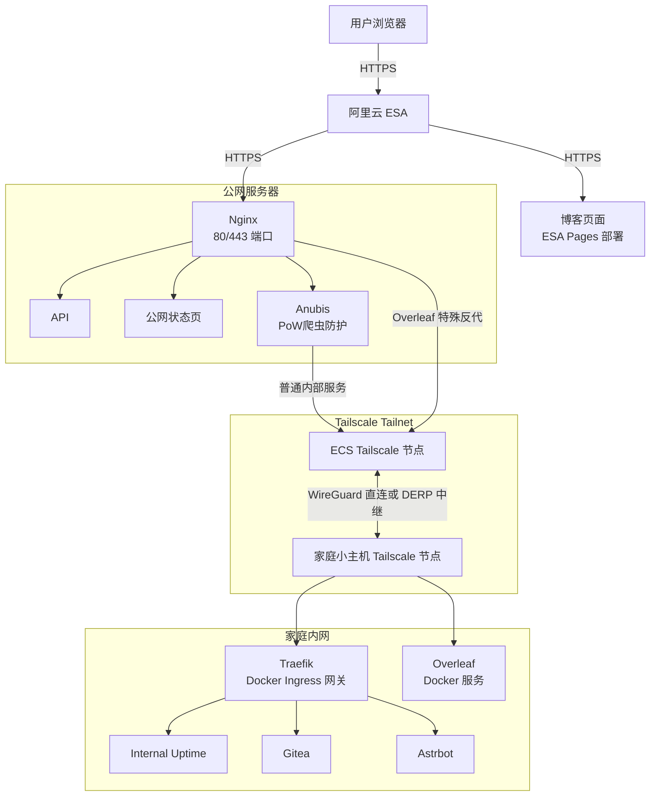

这里主要放一些能公开的入口和站点结构。博客大概率还是我和 AI 一起写，质量不敢保证，但至少尽量别写成那种一眼模板味的东西。



# 常用入口



<!-- cell -->



<!-- cell -->



<!-- cell -->



<!-- cell -->





## 公开服务



<!-- cell -->



<!-- cell -->



<!-- cell -->







因为它们不少其实在家里的小主机上，公网服务器更多像一个入口。中间有 Tailscale、Nginx、Docker、证书、DNS、各种我自己挖的坑。哪天其中一层心情不好，页面就会变成“你访问了，但又没完全访问”。



## 我的站点网络架构

现在已经不太想走 FRP 那种端口级穿透了。不是不能用，而是越用越像在给每个服务单独修一条小路，修多了就烦。现在更像是公网 Nginx 负责入口，后面通过 Tailscale 直接访问内网节点。

Overleaf 比较特殊，路径更直一点：客户端到 Nginx，再过 Tailscale，最后落到 Docker 服务。它不太适合被塞进普通的 Traefik 服务发现里装作没事。

# Special Thanks



<!-- cell -->



<!-- cell -->




