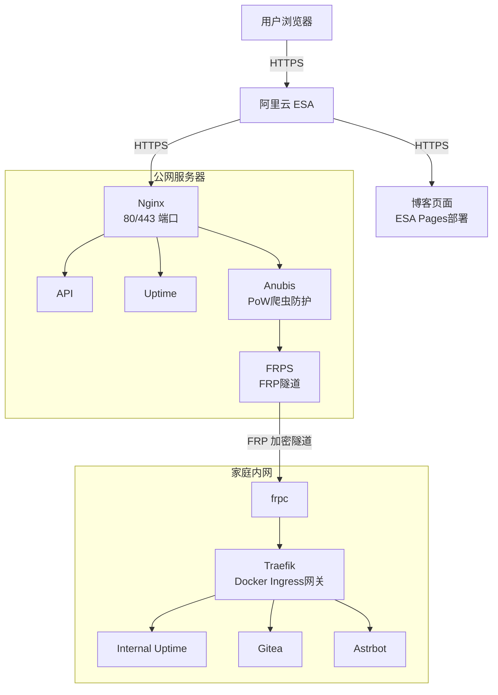

这是我的个人网站主页面，用作个人博客，但是我也不怎么会写博客，所以大概率会让ai和我一起写，质量就不用期待了, 我会 try 一下。

# 站点列表



<!-- cell -->



<!-- cell -->



<!-- cell -->



<!-- cell -->





## 我的可开放的其他站点



<!-- cell -->



<!-- cell -->





还在建设中......

## 我的站点网络架构

希望这些能给你带来一些参考

# Special Thanks



<!-- cell -->



<!-- cell -->




